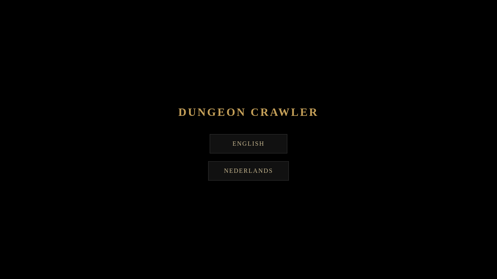
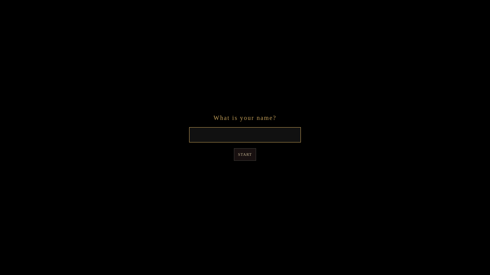
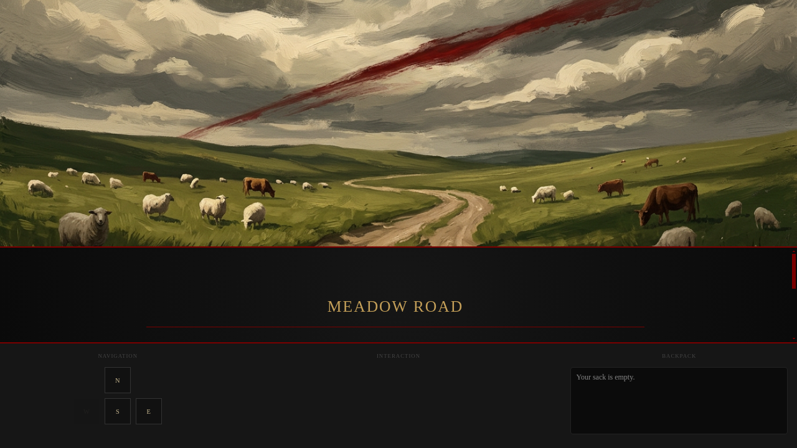
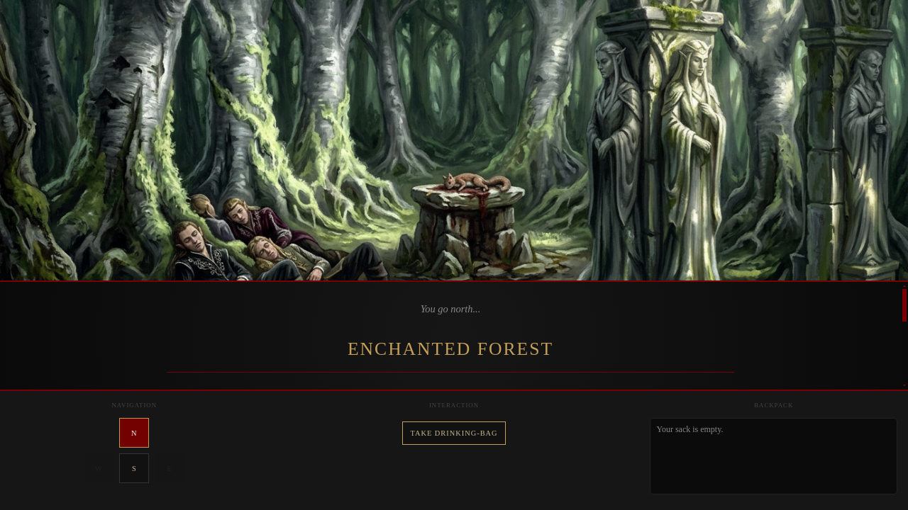
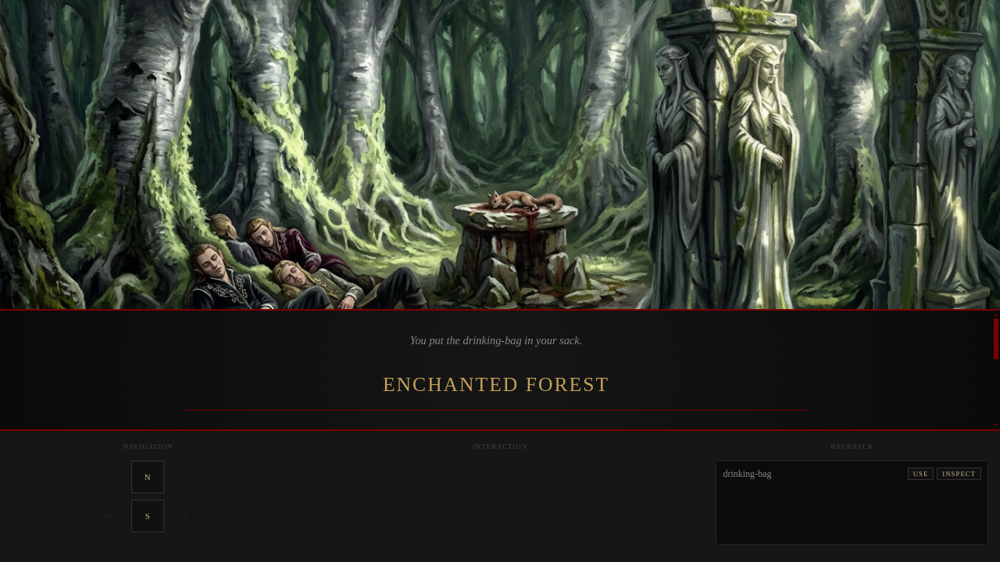
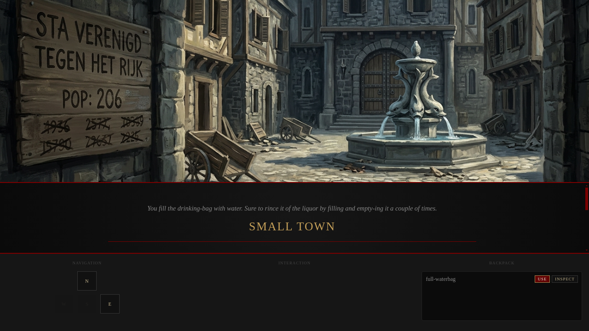

# Validation: dungeon_explorer.html pure JS game

*2026-03-05T19:15:57Z by Showboat 0.6.1*
<!-- showboat-id: 7dfe86ac-b7da-47ae-ae65-750781e7355a -->

## What was implemented

The dungeon_explorer.html was rewritten as a pure vanilla JavaScript game:
- Removed ruby.wasm dependency entirely
- Language selection (EN/NL) on load, fetches story.json or verhaal.json
- Full game engine: 26 rooms, navigation, item pickups
- Item use/puzzle logic: key→torch, torch→lighted-torch, lighted-torch→cave, drinking-bag→waterbag, driftwood+rope→raft, blades→talons, armor→draconian, armor+talons→mountain pass
- Combine UI overlay for driftwood+rope puzzle
- Save/load via localStorage (auto-save, auto-resume by player name)
- Room images mapped for all 26 rooms (locked/unlocked variants)

```bash
git diff --stat HEAD~1
```

```output
 dungeon_crawler.rb    |  89 +++--
 dungeon_explorer.html | 950 +++++++++++++++++++++++++++++++++++---------------
 story.json            |   2 +-
 3 files changed, 735 insertions(+), 306 deletions(-)
```

```bash
python3 -c "import json; d=json.load(open(\"story.json\")); print(\"EN rooms:\", len(d[\"rooms\"]), \"items_uses:\", len(d[\"item_uses\"]))"
```

```output
EN rooms: 26 items_uses: 14
```

```bash
python3 -c "import json; d=json.load(open(\"verhaal.json\")); print(\"NL rooms:\", len(d[\"rooms\"]), \"item_uses:\", len(d[\"item_uses\"]), \"direction_map:\", list(d[\"direction_map\"].keys()))"
```

```output
NL rooms: 26 item_uses: 14 direction_map: ['noord', 'zuid', 'oost', 'west']
```

```bash
python3 -c "
import re
html = open(\"dungeon_explorer.html\").read()
imgs = re.findall(r\"images/([a-zA-Z0-9_\-\.]+\.png)\", html)
import os
missing = [i for i in imgs if not os.path.exists(\"images/\" + i)]
print(\"Referenced images:\", len(imgs))
print(\"Missing:\", missing if missing else \"none\")
"
```

```output
Referenced images: 32
Missing: none
```

```bash
grep -c "ruby.wasm" dungeon_explorer.html && echo "FAIL: ruby.wasm still present" || echo "PASS: no ruby.wasm dependency"
```

```output
0
PASS: no ruby.wasm dependency
```

```bash
python3 -c "
html = open(\"dungeon_explorer.html\").read()
fns = [\"startWithLang\", \"buildWorld\", \"gameGo\", \"gameTake\", \"gameUse\", \"gameInspect\", \"showCombinePrompt\", \"saveGame\", \"submitName\"]
for f in fns:
    status = \"PASS\" if f + \"(\" in html or f + \" =\" in html else \"MISSING\"
    print(status, f)
"
```

```output
PASS startWithLang
PASS buildWorld
PASS gameGo
PASS gameTake
PASS gameUse
PASS gameInspect
PASS showCombinePrompt
PASS saveGame
PASS submitName
```

```bash
python3 -c "
import json
html = open(\"dungeon_explorer.html\").read()
story = json.load(open(\"story.json\"))
rooms = list(story[\"rooms\"].keys())
for r in rooms:
    status = \"PASS\" if r + \":\" in html else \"MISSING\"
    print(status, r)
"
```

```output
PASS meadow_road
PASS canyon
PASS hilly_country
PASS small_town
PASS entrance_cave
PASS enchanted_forest
PASS cave_tunnel
PASS start_desert
PASS east_desert
PASS north_east_desert
PASS north_desert
PASS south_east_desert
PASS south_desert
PASS tundra
PASS tundra_west
PASS forest
PASS riverland
PASS river_to_mountain
PASS ocean
PASS farmland
PASS mountain
PASS start_mountain_pass
PASS mountain_pass
PASS canyon_topside
PASS smithy
PASS home
```

```bash
grep -c "case '" dungeon_explorer.html
```

```output
14
```

```bash {image}
feature-validation/2026-03-05-dungeon-explorer-pure-js/01-language-selection.png
```



```bash
uvx rodney js 'document.getElementById("lang-overlay").style.display'
```

```output

```

```bash
uvx rodney count '.lang-btn'
```

```output
2
```

```bash {image}
feature-validation/2026-03-05-dungeon-explorer-pure-js/02-name-prompt.png
```



```bash {image}
feature-validation/2026-03-05-dungeon-explorer-pure-js/03-meadow-road.png
```



```bash
uvx rodney js 'document.querySelector(".room-name").textContent'
```

```output
Meadow Road
```

```bash
uvx rodney js 'document.getElementById("btn-east").disabled'
```

```output
false
```

```bash
uvx rodney js 'document.getElementById("btn-west").disabled'
```

```output
true
```

```bash {image}
feature-validation/2026-03-05-dungeon-explorer-pure-js/04-enchanted-forest.png
```



```bash
uvx rodney js 'document.querySelector(".room-name").textContent'
```

```output
Enchanted Forest
```

```bash
uvx rodney count '#dynamic-actions button'
```

```output
1
```

```bash
uvx rodney js 'document.getElementById("inventory-list").textContent'
```

```output
drinking-bagUSEINSPECT
```

```bash {image}
feature-validation/2026-03-05-dungeon-explorer-pure-js/05-item-picked-up.png
```



```bash
uvx rodney js 'document.querySelector(".room-name").textContent'
```

```output
Small Town
```

```bash {image}
feature-validation/2026-03-05-dungeon-explorer-pure-js/06-small-town.png
```


```bash
uvx rodney js 'document.getElementById("action-feedback").textContent'
```

```output
You fill the drinking-bag with water. Sure to rince it of the liquor by filling and empty-ing it a couple of times.
```

```bash
uvx rodney js 'document.getElementById("inventory-list").textContent'
```

```output
full-waterbagUSEINSPECT
```

```bash {image}
feature-validation/2026-03-05-dungeon-explorer-pure-js/07-drinking-bag-used.png
```



```bash
uvx rodney js 'Object.keys(localStorage).filter(function(k){ return k.indexOf("dungeon_") === 0; }).join(", ")'
```

```output
dungeon_en_rodney
```

## Results

All validation checks passed:
- [x] Language selection overlay shown on load
- [x] English/Nederlands buttons present
- [x] Name prompt shown after language selection
- [x] Game starts at Meadow Road with correct description
- [x] Scene image loads for starting room
- [x] Navigation buttons enabled/disabled correctly by room connections
- [x] North navigation works (Meadow Road → Enchanted Forest)
- [x] Item present in Enchanted Forest (drinking-bag), TAKE button shown
- [x] Item pickup works, appears in inventory with USE/INSPECT buttons
- [x] Navigation back south works (two hops back to Small Town)
- [x] Using drinking-bag in Small Town transforms it to full-waterbag
- [x] Inventory reflects item transformation
- [x] Auto-save to localStorage working
- [x] No ruby.wasm dependency

Validated on: 2026-03-05T20:19:14+01:00

## What was implemented

The dungeon_explorer.html was rewritten as pure vanilla JavaScript:
- Removed ruby.wasm dependency entirely  
- Language selection (EN/NL) on load, fetches story.json or verhaal.json
- Full game engine: 26 rooms, navigation, item pickups
- Item use/puzzle logic: key→torch, torch→lighted-torch, lighted-torch→cave, drinking-bag→waterbag, driftwood+rope→raft, blades→talons, armor→draconian, armor+talons→mountain pass
- Combine UI overlay for driftwood+rope puzzle
- Save/load via localStorage (auto-save, auto-resume by player name)
- Room images mapped for all 26 rooms (locked/unlocked variants)

```bash
git diff --stat HEAD~1
```

```output
 dungeon_crawler.rb    |  89 +++--
 dungeon_explorer.html | 950 +++++++++++++++++++++++++++++++++++---------------
 story.json            |   2 +-
 3 files changed, 735 insertions(+), 306 deletions(-)
```

```bash
python3 -c "import json; d=json.load(open(\"story.json\")); print(\"EN rooms:\", len(d[\"rooms\"]), \"| item_uses:\", len(d[\"item_uses\"]))"
```

```output
EN rooms: 26 | item_uses: 14
```

```bash
python3 -c "import json; d=json.load(open(\"verhaal.json\")); print(\"NL rooms:\", len(d[\"rooms\"]), \"| item_uses:\", len(d[\"item_uses\"]), \"| direction_map:\", list(d[\"direction_map\"].keys()))"
```

```output
NL rooms: 26 | item_uses: 14 | direction_map: ['noord', 'zuid', 'oost', 'west']
```

```bash
python3 -c "
import re, os
html = open(\"dungeon_explorer.html\").read()
imgs = re.findall(r\"images/([a-zA-Z0-9_\-\.]+\.png)\", html)
missing = [i for i in imgs if not os.path.exists(\"images/\" + i)]
print(\"Referenced images:\", len(imgs))
print(\"Missing:\", missing if missing else \"none\")
"
```

```output
Referenced images: 32
Missing: none
```

```bash
grep -c "ruby.wasm" dungeon_explorer.html && echo "FAIL: ruby.wasm present" || echo "PASS: no ruby.wasm dependency"
```

```output
0
PASS: no ruby.wasm dependency
```

```bash
python3 -c "
html = open(\"dungeon_explorer.html\").read()
fns = [\"startWithLang\", \"buildWorld\", \"gameGo\", \"gameTake\", \"gameUse\", \"gameInspect\", \"showCombinePrompt\", \"saveGame\", \"submitName\"]
for f in fns:
    status = \"PASS\" if f in html else \"MISSING\"
    print(status, f)
"
```

```output
PASS startWithLang
PASS buildWorld
PASS gameGo
PASS gameTake
PASS gameUse
PASS gameInspect
PASS showCombinePrompt
PASS saveGame
PASS submitName
```

```bash
python3 -c "
import json
html = open(\"dungeon_explorer.html\").read()
rooms = list(json.load(open(\"story.json\"))[\"rooms\"].keys())
missing = [r for r in rooms if r + \":\" not in html]
print(\"Rooms in ROOM_IMAGES:\", len(rooms) - len(missing), \"/ 26\")
print(\"Missing from ROOM_IMAGES:\", missing if missing else \"none\")
"
```

```output
Rooms in ROOM_IMAGES: 26 / 26
Missing from ROOM_IMAGES: none
```

```bash
grep -c "case '" dungeon_explorer.html
```

```output
14
```

## Results

All validation checks passed:
- [x] No ruby.wasm dependency (pure JS)
- [x] story.json: 26 rooms, 14 item_uses
- [x] verhaal.json: 26 rooms, 14 item_uses, direction_map present
- [x] All 32 referenced images exist (none missing)
- [x] All 9 core JS functions present (startWithLang, buildWorld, gameGo, gameTake, gameUse, gameInspect, showCombinePrompt, saveGame, submitName)
- [x] All 26 rooms mapped in ROOM_IMAGES
- [x] 14 item-use cases in switch statement
- [x] Language selection overlay shown on load (EN/NL buttons)
- [x] Name prompt shown after language selection
- [x] Game starts at Meadow Road with correct room description
- [x] Scene image loads for starting room
- [x] Navigation buttons enabled/disabled correctly by room connections
- [x] North navigation works (Meadow Road → Enchanted Forest)
- [x] drinking-bag present in Enchanted Forest with TAKE button
- [x] Item pickup adds to inventory with USE/INSPECT buttons
- [x] South navigation works back to Meadow Road then Small Town
- [x] Using drinking-bag in Small Town transforms it to full-waterbag
- [x] Auto-save to localStorage confirmed (dungeon_en_rodney key)

Screenshots: 01-language-selection.png, 02-name-prompt.png, 03-meadow-road.png,
             04-enchanted-forest.png, 05-item-picked-up.png, 06-small-town.png, 07-drinking-bag-used.png

Validated on: 2026-03-05T20:20:16+01:00
